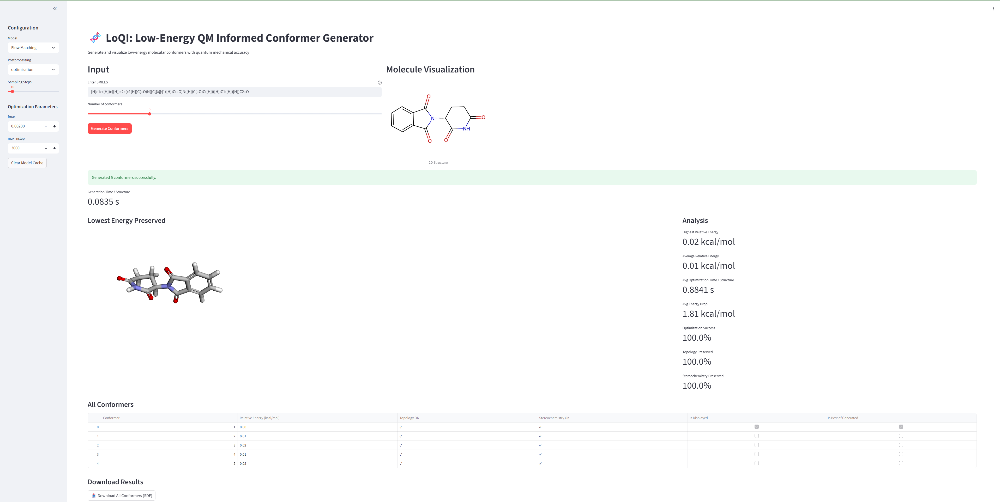

# LoQI: Scalable Low-Energy Molecular Conformer Generation with Quantum Mechanical Accuracy

<div align="center">
  <a href="https://scholar.google.com/citations?user=DOljaG8AAAAJ&hl=en" target="_blank">Filipp&nbsp;Nikitin<sup>1,2</sup></a> &emsp; <b>&middot;</b> &emsp;
  <a href="#" target="_blank">Dylan&nbsp;M.&nbsp;Anstine<sup>2,3</sup></a> &emsp; <b>&middot;</b> &emsp;
  <a href="#" target="_blank">Roman&nbsp;Zubatyuk<sup>2,5</sup></a> &emsp; <b>&middot;</b> &emsp;
  <a href="https://scholar.google.ch/citations?user=8S0VfjoAAAAJ&hl=en" target="_blank">Saee&nbsp;Gopal&nbsp;Paliwal<sup>5</sup></a> &emsp; <b>&middot;</b> &emsp;
  <a href="https://olexandrisayev.com/" target="_blank">Olexandr&nbsp;Isayev<sup>1,2,4*</sup></a>
  <br>
  <sup>1</sup>Ray and Stephanie Lane Computational Biology Department, Carnegie Mellon University, Pittsburgh, PA, USA
  <br>
  <sup>2</sup>Department of Chemistry, Carnegie Mellon University, Pittsburgh, PA, USA
  <br>
  <sup>3</sup>Department of Chemical Engineering and Materials Science, Michigan State University, East Lansing, MI, USA
  <br>
  <sup>4</sup>Department of Materials Science and Engineering, Carnegie Mellon University, Pittsburgh, PA, USA
  <br>
  <sup>5</sup>NVIDIA, Santa Clara, CA, USA
  <br><br>
  <a href="#" target="_blank">📄&nbsp;Paper</a> &emsp; <b>&middot;</b> &emsp;
  <a href="#citation">📖&nbsp;Citation</a> &emsp; <b>&middot;</b> &emsp;
  <a href="#setup">⚙️&nbsp;Setup</a> &emsp; <b>&middot;</b> &emsp;
  <a href="https://github.com/isayevlab/LoQI" target="_blank">🔗&nbsp;GitHub</a>
  <br><br>
  <span><sup>*</sup>Corresponding author: olexandr@olexandrisayev.com</span>
</div>

---

## Overview

<div align="center">
    
</div>

### Abstract

Molecular geometry is crucial for biological activity and chemical reactivity; however, computational methods for generating 3D structures are limited by the vast scale of conformational space and the complexities of stereochemistry. Here we present an approach that combines an expansive dataset of molecular conformers with generative diffusion models to address this problem. We introduce **ChEMBL3D**, which contains over 250 million molecular geometries for 1.8 million drug-like compounds, optimized using AIMNet2 neural network potentials to a near-quantum mechanical accuracy with implicit solvent effects included. This dataset captures complex organic molecules in various protonation states and stereochemical configurations. 

We then developed **LoQI** (Low-energy QM Informed conformer generative model), a stereochemistry-aware diffusion model that learns molecular geometry distributions directly from this data. Through graph augmentation, LoQI accurately generates molecular structures with targeted stereochemistry, representing a significant advance in modeling capabilities over previous generative methods. The model outperforms traditional approaches, achieving up to tenfold improvement in energy accuracy and effective recovery of optimal conformations. Benchmark tests on complex systems, including macrocycles and flexible molecules, as well as validation with crystal structures, show LoQI can perform low energy conformer search efficiently.

> **Note on Implementation**: LoQI is built upon the [Megalodon architecture](https://arxiv.org/pdf/2505.18392) developed, adapting it specifically for stereochemistry-aware conformer generation with the ChEMBL3D dataset.

---

## Key Features

- **ChEMBL3D Dataset**: 250+ million AIMNet2-optimized conformers for 1.8M drug-like molecules
- **Stereochemistry-Aware**: First all-atom diffusion model with explicit stereochemical encoding
- **Quantum Mechanical Accuracy**: Near-DFT accuracy with implicit solvent effects
- **Superior Performance**: Up to 10x improvement in energy accuracy over traditional methods
- **Complex Molecule Support**: Handles macrocycles, flexible molecules, and challenging stereochemistry

---

## Setup

Installation will usually take up to 20 minutes.

### System and Hardware Requirements

- OS tested by authors:
  - Ubuntu 24.04 LTS (latest stable Ubuntu LTS at time of writing)
- Other platforms:
  - Expected to work, but if installation is not out-of-the-box, use the PyTorch Geometric installation guide for your exact Python/PyTorch/CUDA combination:
    https://pytorch-geometric.readthedocs.io/en/latest/install/installation.html
- Tested inference hardware:
  - GPU: NVIDIA RTX 3090 (24 GB VRAM)
  - CPU: AMD Ryzen 9 5950X
- Recommended GPU memory:
  - 16-24 GB VRAM for comfortable inference/evaluation with larger molecules and higher batch sizes
- Minimum practical GPU memory:
  - 8 GB VRAM can run inference, but requires reduced batch sizes
- CPU-only:
  - Possible, but not recommended and not systematically studied by the authors

OOM mitigation for larger molecules:
- reduce inference batch size (`--batch_size` in sampling, or `data.inference_batch_size` in config)
- if using evaluation/optimization, also reduce optimization batch size (`evaluation.energy_metrics_args.batchsize`)

### Prerequisites

- Python 3.10+
- CUDA-compatible GPU (recommended for training)
- [Conda](https://docs.conda.io/) or [Mamba](https://mamba.readthedocs.io/) (recommended)

### Environment Setup

```bash
# Clone the repository
git clone https://github.com/isayevlab/LoQI.git
cd LoQI

# Create and activate conda environment
conda create -n loqi python=3.10 -y
conda activate loqi

# Install core dependencies
pip install -r requirements.txt

# Install this package in editable mode (adds src to PYTHONPATH)
pip install -e .
```

If you prefer a fully conda-based setup (recommended for RDKit), you can install RDKit via conda-forge before running `pip install -r requirements.txt`.

### Data Setup

The training and evaluation require the **ChEMBL3D** dataset. 

**Available with this release [Download Here](https://drive.google.com/drive/folders/1PvSrep7_qIjTSslzXD3KUYEJ2Qr2lgDD?usp=sharing):**
- Pre-trained LoQI model checkpoint (`loqi.ckpt`)
- Processed ChEMBL3D lowest-energy conformers dataset (`chembl3d_stereo`)

**Coming soon:**
- Full ChEMBL3D dataset (250M+ conformers) will be released in a separate repository
- Complete dataset processing scripts and pipeline

Place downloaded assets in the repository with this layout:
```text
LoQI/
  data/
    loqi.ckpt
    loqi_flow.ckpt
    chembl3d_stereo/
      processed/
        ...
```

AimNet2 model path expected by configs:
```text
src/megalodon/metrics/aimnet2/cpcm_model/wb97m_cpcms_v2_0.jpt
```

---

## Web App

The repository includes a Streamlit interface for interactive conformer generation, postprocessing, and visualization.

<div align="center">
    
</div>

Use the app-specific installation and usage instructions from `app/README.md` (recommended, as app dependencies are separated from core training/inference dependencies).  
Quick start from repo root:

```bash
pip install -r app/requirements.txt
streamlit run app/app.py
```

## Usage

Make sure that `src` content is available in your `PYTHONPATH` (e.g., `export PYTHONPATH="./src:$PYTHONPATH"`) if LoQI is not installed locally (`pip install -e .`). 

### Model Training

```bash
# LoQI conformer generation model
python scripts/train.py --config-name=loqi outdir=./outputs train.gpus=1 data.dataset_root="./chembl3d_data"

# LoQI flow-matching conformer generation model
python scripts/train.py --config-name=loqi_flow outdir=./outputs train.gpus=1 data.dataset_root="data/chembl3d_stereo"

# Customize training parameters
python scripts/train.py --config-name=loqi \
    outdir=./outputs \
    train.gpus=2 \
    train.n_epochs=800 \
    train.seed=42 \
    data.batch_size=150 \
    optimizer.lr=0.0001
```

### Model Inference and Sampling

#### Conformer Generation

```bash
# Generate conformers for a single molecule
python scripts/sample_conformers.py \
    --config scripts/conf/loqi/loqi.yaml \
    --ckpt data/loqi.ckpt \
    --input "c1ccccc1" \
    --output outputs/benzene_conformers.sdf \
    --n_confs 10 \
    --batch_size 1

# Generate conformers with evaluation (requires 3D input, e.g., SDF with low energy conformer)
python scripts/sample_conformers.py \
    --config scripts/conf/loqi/loqi.yaml \
    --ckpt data/loqi.ckpt \
    --input data/ethanot_low_energy.sdf \
    --output outputs/ethanol_conformers.sdf \
    --n_confs 100 \
    --batch_size 10 \
    --eval
```

On the tested setup (RTX 3090 + Ryzen 9 5950X), inference for a typical ChEMBL molecule takes approximately 0.1 seconds per conformer when processed within a batch. See **System and Hardware Requirements** above for VRAM guidance and OOM mitigation.

Note: Make sure you define correct paths for dataset and AimNet2 model in `loqi.yaml`. The relative path of AimNet2 model is `src/megalodon/metrics/aimnet2/cpcm_model/wb97m_cpcms_v2_0.jpt`.

Sampling steps: `--n_steps` defaults to 25. Diffusion models were trained with 25 steps and are not expected to work well for other values. Flow-matching models can be run with different step counts.

#### Available Configurations

**LoQI Models:**
- `loqi.yaml` - LoQI stereochemistry-aware conformer generation model
- `nextmol.yaml` - Alternative configuration for NextMol-style generation
- `loqi_flow.yaml` - LoQI flow-matching conformer generation model

---

## Citation

If you use LoQI in your research, please cite our paper:

```bibtex
@article{nikitin2025scalable,
  title={Scalable Low-Energy Molecular Conformer Generation with Quantum Mechanical Accuracy},
  author={Nikitin, Filipp and Anstine, Dylan M and Zubatyuk, Roman and Paliwal, Saee Gopal and Isayev, Olexandr},
  year={2025}
}
```

This work builds upon the Megalodon architecture. If you use the underlying architecture, please also cite:

```bibtex
@article{reidenbach2025applications,
  title={Applications of Modular Co-Design for De Novo 3D Molecule Generation},
  author={Reidenbach, Danny and Nikitin, Filipp and Isayev, Olexandr and Paliwal, Saee},
  journal={arXiv preprint arXiv:2505.18392},
  year={2025}
}
```
