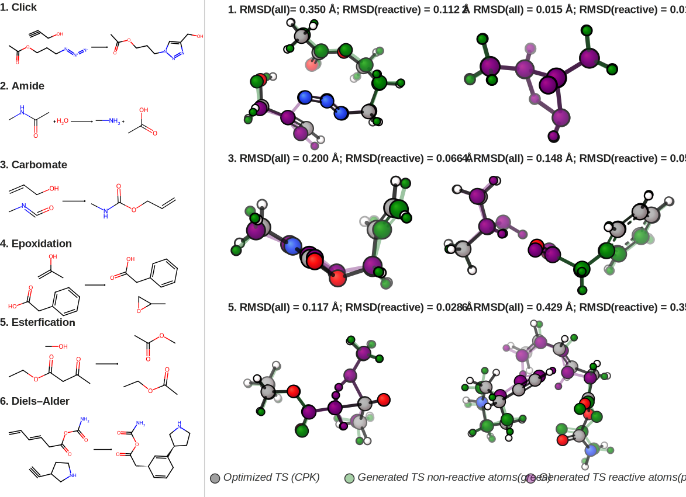

# Right into the Saddle: Stereochemistry-Aware Generation of Molecular Transition States

<div align="center">
  <a href="https://scholar.google.com/citations?user=DOljaG8AAAAJ&hl=en" target="_blank">Filipp&nbsp;Nikitin<sup>1,2</sup></a> &emsp; <b>&middot;</b> &emsp;
  <a href="#" target="_blank">Dylan&nbsp;M.&nbsp;Anstine<sup>2,3</sup></a> &emsp; <b>&middot;</b> &emsp;
  <a href="https://olexandrisayev.com/" target="_blank">Olexandr&nbsp;Isayev<sup>1,2,4*</sup></a>
  <br>
  <sup>1</sup>Ray and Stephanie Lane Computational Biology Department, Carnegie Mellon University, Pittsburgh, PA, USA
  <br>
  <sup>2</sup>Department of Chemistry, Carnegie Mellon University, Pittsburgh, PA, USA
  <br>
  <sup>3</sup>Department of Chemical Engineering and Materials Science, Michigan State University, East Lansing, MI, USA
  <br>
  <sup>4</sup>Department of Materials Science and Engineering, Carnegie Mellon University, Pittsburgh, PA, USA
  <br><br>
  <a href="#" target="_blank">📄&nbsp;Paper</a> &emsp; <b>&middot;</b> &emsp;
  <a href="#citation">📖&nbsp;Citation</a> &emsp; <b>&middot;</b> &emsp;
  <a href="#setup">⚙️&nbsp;Setup</a> &emsp; <b>&middot;</b> &emsp;
  <a href="https://github.com/isayevlab/TSMegaGen" target="_blank">🔗&nbsp;GitHub</a>
  <br><br>
  <span><sup>*</sup>Corresponding author: olexandr@olexandrisayev.com</span>
</div>

---

## Overview

<div align="center">
    
</div>

### Abstract

Traditional strategies for calculating molecular transition states are laborious and computationally intensive, thus bottlenecking the scale of reaction modeling. To overcome this limitation, we introduce a flow-matching model, RitS, that directly generates high-quality transition states using only the connectivity of reactants and products as input. Leveraging a newly constructed dataset of approximately 2 million transition states, we substantially expand the applicability of previous approaches, which are typically trained on the Transition1x dataset, to cover CHNOSFP elements, larger molecular systems, and both neutral and charged reactions. On the Transition1x benchmark, our model achieves superior performance compared to existing generative approaches. Importantly, RitS enables stereochemistry-aware transition-state generation. We demonstrate selective generation of endo/exo Diels-Alder transition states as well as stereodefined E/Z transition states for chlorostyrene halogenation reactions. Furthermore, the model generalizes to complex multistep organocatalytic reactions, including the classical Hajos-Parrish-Eder-Sauer-Wiechert reaction. Overall, this work represents an important step toward scalable, automated, and high-throughput reaction mechanism analysis that can continue to improve as larger mechanistic datasets become available.


## Key Features

- **Direct transition-state generation**  
  Generates 3D transition-state geometries directly from reactant and product connectivity without requiring hand-crafted initial guesses.

- **Stereochemistry-aware generation**  
  Supports explicit stereochemical control, enabling generation of transition states corresponding to competing pathways such as **endo/exo** and **E/Z** configurations.

- **Flow-matching generative model**  
  Uses a flow-matching objective with **Kabsch-aligned optimal transport** for stable and efficient molecular geometry generation.

- **Large-scale training dataset**  
  Trained on a dataset of **~2 million transition-state reactions** constructed through mechanistic enumeration and active learning.

---

## Setup

Installation will usually take up to 20 minutes.

### System and Hardware Requirements

- OS tested by authors:
  - Ubuntu 24.04 LTS (latest stable Ubuntu LTS at time of writing)
- Other platforms:
  - Expected to work, but if installation is not out-of-the-box, use the PyTorch Geometric installation guide for your exact Python/PyTorch/CUDA combination:
    https://pytorch-geometric.readthedocs.io/en/latest/install/installation.html
- Tested inference hardware:
  - GPU: NVIDIA RTX 3090 (24 GB VRAM)
  - CPU: AMD Ryzen 9 5950X
- Recommended GPU memory:
  - 16-24 GB VRAM for comfortable inference/evaluation with larger molecules and higher batch sizes
- Minimum practical GPU memory:
  - 8 GB VRAM can run inference, but requires reduced batch sizes
- CPU-only:
  - Possible, but not recommended and not systematically studied by the authors

OOM mitigation for larger molecules:
- reduce inference batch size (`--batch_size` in sampling, or `data.inference_batch_size` in config)

### Prerequisites

- Python 3.10+
- CUDA-compatible GPU (recommended for training)
- [Conda](https://docs.conda.io/) or [Mamba](https://mamba.readthedocs.io/) (recommended)

### Environment Setup

```bash
# Clone the repository
git clone https://github.com/isayevlab/RitS.git
cd RitS

# Create and activate conda environment
conda create -n rits python=3.10 -y
conda activate rits

# Install dependencies
pip install -r requirements.txt
pip install -e .
```

If you prefer a fully conda-based setup (recommended for RDKit), you can install RDKit via conda-forge before running `pip install -r requirements.txt`.

For the interactive Streamlit app and IRC post-processing, also install:

```bash
pip install -r app/requirements.txt
conda install -c conda-forge xtb
```

### Data Setup

Release folder: [Google Drive](https://drive.google.com/drive/folders/1DD2hmWx3E1klM3Ljon5r4gdquGoN_4v6?usp=sharing)

Available now:
- Transition1x training data
- Transition1x checkpoint
- RitS checkpoint trained on our large GFN2-xTB dataset (`data/rits.ckpt`)

Will be available later:
- The large GFN2-xTB dataset itself

Expected local layout:

```text
data/
  rits.ckpt
  ts1x_rits.ckpt
  Transition1x/
    wb97xd3/
      raw_data/
        wb97xd3_ts.xyz
        wb97xd3_fwd_rev_chemprop.csv
```

Preprocess Transition1x for training:

```bash
python data_processing/prepare_ts1x_for_training.py \
    --ts_data data/Transition1x/wb97xd3/raw_data/wb97xd3_ts.xyz \
    --rxn_smarts_file data/Transition1x/wb97xd3/raw_data/wb97xd3_fwd_rev_chemprop.csv \
    --save_dir data/ts1x
```


---

## Usage

Lightweight runnable examples are available in [`examples/`](examples/), with one folder per reaction family (reaction scheme image(s) + `cmd.sh`).

### Model Training

```bash
# Train transition state model from scratch
python scripts/train.py \
    --config-path=conf \
    --config-name rits \
    train.gpus=1 \
    train.seed=28 \
    run_name=test_train \
    outdir="../test_runs" \
    data.dataset_root="./data/ts1x"

# Resume training from checkpoint
python scripts/train.py \
    --config-path=conf \
    --config-name rits \
    train.gpus=1 \
    train.seed=28 \
    run_name=test_train \
    outdir="../test_runs" \
    resume="./data/rits.ckpt"

# Customize training parameters
python scripts/train.py \
    --config-path=conf \
    --config-name rits \
    outdir=./outputs \
    train.gpus=2 \
    train.n_epochs=800 \
    train.seed=42 \
    data.batch_size=150 \
    optimizer.lr=0.0001
```

### Model Inference and Sampling

#### Transition States Generation

```bash
# Generate transition states from atom-mapped SMILES
python scripts/sample_transition_state.py \
    --reactant_smi "[C:1]([c:2]1[n:3][o:4][n:5][n:6]1)([H:7])([H:8])[H:9]" \
    --product_smi "[C:1]1([H:7])([H:8])/[C:2](=[N:3]\\[H:9])[N:6]1[N:5]=[O:4]" \
    --config scripts/conf/rits.yaml \
    --ckpt data/rits.ckpt \
    --output output.xyz \
    --n_samples 1 \
    --batch_size 32

# Generate transition states from XYZ files
python scripts/sample_transition_state.py \
    --reactant_xyz reactant.xyz \
    --product_xyz product.xyz \
    --config scripts/conf/rits.yaml \
    --ckpt data/rits.ckpt \
    --output output.xyz \
    --n_samples 5 \
    --batch_size 32

# Generate multiple samples per reaction
python scripts/sample_transition_state.py \
    --reactant_smi "[C:1][C:2]([H:3])([H:4])[H:5]" \
    --product_smi "[C:1]=[C:2]([H:3])[H:4]" \
    --config scripts/conf/rits.yaml \
    --ckpt data/rits.ckpt \
    --output ts_samples.xyz \
    --n_samples 10 \
    --batch_size 32
```

**Input formats:**
- **SMILES**: Atom-mapped SMILES with explicit hydrogens (e.g., `[C:1][H:2]`)
- **XYZ**: Standard XYZ coordinate files (bonds will be inferred using OpenBabel)

**Notes:**
- SMILES must have explicit hydrogens and can use atom mapping to specify atom correspondence
- Reactant and product must have the same number of atoms
- Output is saved as XYZ file(s) with transition state coordinates   

#### Available Configurations

**Transition State Configs:**
- `rits.yaml` - RitS stereochemistry-aware conformer generation model trained on our dataset
- `ts1x_rits.yaml` - RitS configuration for Transition1x training/evaluation

### Interactive App

We also provide an interactive Streamlit web application to make it easier to use RitS without writing any code. The app allows you to select from built-in example reactions or enter custom reaction SMARTS, generate transition states, visualize 2D reaction schemes and 3D transition-state geometries, and optionally run IRC post-processing with pysisyphus.

<div align="center">
    
</div>

```bash
# Install app dependencies (if not already done)
pip install -r app/requirements.txt
conda install -c conda-forge xtb

# Run the app
streamlit run app/app.py
```

See [`app/README.md`](app/README.md) for more details.

### Training Configuration

You can easily override configuration parameters:

```bash
# Example with custom parameters
python scripts/train.py \
    --config-path=conf \
    --config-name rits \
    outdir=./my_training \
    run_name=my_experiment \
    train.gpus=4 \
    train.n_epochs=500 \
    data.batch_size=64 \
    data.dataset_root="./data/ts1x" \
    wandb_params.mode=online
```

---

## Citation

RitS preprint citation:

```bibtex
@article{
doi:10.26434/chemrxiv.15001681/v1,
author = {Filipp Nikitin  and Dylan M. Anstine  and Olexandr Isayev },
title = {Right into the Saddle: Stereochemistry-Aware Generation of Molecular Transition States},
journal = {ChemRxiv},
volume = {2026},
number = {0406},
pages = {},
year = {2026},
doi = {10.26434/chemrxiv.15001681/v1},
URL = {https://chemrxiv.org/doi/abs/10.26434/chemrxiv.15001681/v1},
eprint = {https://chemrxiv.org/doi/pdf/10.26434/chemrxiv.15001681/v1},
}
```

You may also find useful our previous LoQI paper:

```bibtex
@article{loqi,
author = {Filipp Nikitin  and Dylan M. Anstine  and Roman Zubatyuk  and Saee Gopal Paliwal  and Olexandr Isayev },
title = {Scalable Low-Energy Molecular Conformer Generation with Quantum Mechanical Accuracy},
journal = {ChemRxiv},
volume = {2025},
number = {0820},
pages = {},
year = {2025},
doi = {10.26434/chemrxiv-2025-k4h7v},
URL = {https://chemrxiv.org/doi/abs/10.26434/chemrxiv-2025-k4h7v},
eprint = {https://chemrxiv.org/doi/pdf/10.26434/chemrxiv-2025-k4h7v}}
```

This work builds upon the Megalodon architecture. If you use the underlying architecture, please also cite:

```bibtex
@article{reidenbach2026applications,
  title={Applications of modular co-design for de novo 3d molecule generation},
  author={Reidenbach, Danny and Nikitin, Filipp and Isayev, Olexandr and Paliwal, Saee Gopal},
  journal={Digital Discovery},
  year={2026},
  publisher={Royal Society of Chemistry}
}
```
